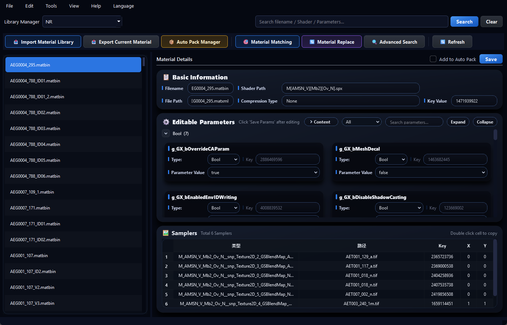
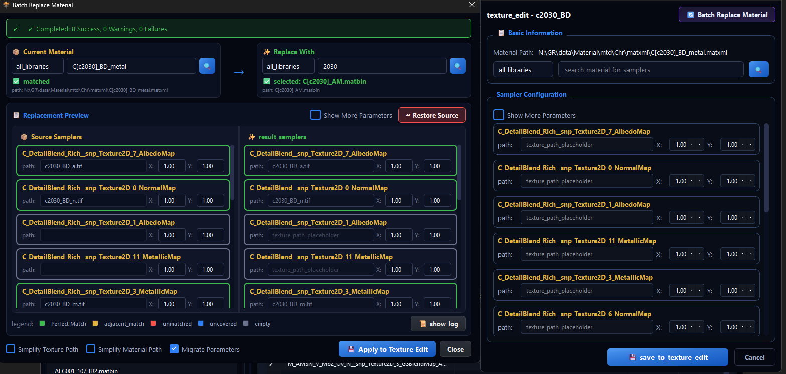

<div align="center">
  

  # FSMatbinBD
  
  **Material Database Manager for FromSoftware Games**
  
  [](https://github.com/ccccxp/FSmatbinBD/actions)
  [](https://github.com/ccccxp/FSmatbinBD/releases)
  [](LICENSE)
  [](https://github.com/ccccxp/FSmatbinBD/releases)

  [**English**](README.md) | [**简体中文**](README_CN.md)

</div>

<br/>

FSMatbinBD is a utility designed to parse and create a searchable index of material definition files (MTD/MATBIN) used in FromSoftware games, including **Elden Ring**, **Dark Souls 3**, **Sekiro**, and **Nightreign**.

It unpacks material archives into a local SQLite database, allowing users to query material properties, find compatible assets for model porting, and batch-edit texture paths without manually editing XML files.



## Features

- **Material Library Import**
  - Parses `.mtdbnd.dcx` and `.matbinbnd.dcx` files.
  - Indexes metadata including shader paths, parameter values, and texture slots.
  - Supports switching between multiple game databases.

- **Search & Filtering**
  - Keyword search by material name, filename, or shader source.
  - Structured filtering by internal properties (e.g., shader type, sampler count, alpha blend mode).

- **Material Similarity Matching**
  - Calculates similarity scores between materials based on texture slots, parameters, and naming patterns.
  - Assists in identifying compatible materials when porting meshes between games (e.g., DS3 to ER).

- **Editing & Batch Processing**
  - View and edit material parameters.
  - Batch replace texture paths using string replacement or regex patterns.
  - Integrated repacking via [WitchyBND](https://github.com/ividyon/WitchyBND) to generate valid DCX files.

## Installation

### Option 1: Full Package
Includes a pre-built database for recent games.

1. Download `FSMatbinBD_vX.X.X_Windows_x64_Full.zip` from [Releases](https://github.com/ccccxp/FSmatbinBD/releases).
2. Extract and run `FSMatbinBD.exe`.

### Option 2: Lite Package
Contains only the executable. Users can import their own game files.

1. Download `FSMatbinBD_vX.X.X_Windows_x64_Lite.zip`.
2. Extract and run `FSMatbinBD.exe`.
3. **Database Setup**:
   - **Import**: Click `Library Manager` → `Import DCX` and select a material archive (e.g., `allmaterialbnd.mtdbnd.dcx`) from your game dump.
   - **Or**: Download a separate `materials.db` and place it in `internal/data/databases/`.

## Workflow: Model Porting

Example workflow for porting a mesh from Dark Souls 3 to Elden Ring:



1. **Import Config**: Export the material JSON from the source model (via FLVER Editor) and import it into the **Material Replacement** module.
2. **Match Materials**: Use the **Material Matching** function to identify compatible materials in the target game library based on mesh paths or names.
3. **Batch Replace**: In **Material Replacement** → **Texture Edit** → **Batch Replace**, input the matched material name and execute.
   - *Note*: If texture paths are empty, the tool automatically retrieves standard textures from the database and maps them to the correct sampler slots.

## Build from Source

Requires Python 3.11+.

```bash
git clone https://github.com/ccccxp/FSmatbinBD.git
cd FSmatbinBD
pip install -r requirements.txt
python qt_main.py
```

## Acknowledgments

- **[WitchyBND](https://github.com/ividyon/WitchyBND)**: Used for unpacking and repacking FromSoftware asset containers.
- **SoulsMods Community**: For documentation on file formats.

## License

MIT License. See [LICENSE](LICENSE) for details.